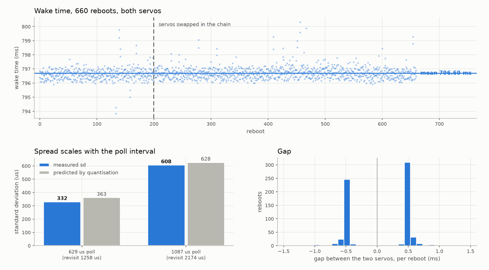

# Reboot timing

Measured on two STS3215 servos at 1 Mbps over a Waveshare adapter, macOS host.
Reproduce with `experiments/measure_reboot.py` and `experiments/plot_reboot.py`.



## Result

Broadcast instruction `0x08` and a servo answers again **796.6 ms later**. Not
approximately — that number is repeatable to well under a millisecond, reboot after
reboot, for hours.

| | mean | sd | min | max | n |
|---|---|---|---|---|---|
| servo A | 796.658 ms | 0.330 ms | 796.02 | 797.67 | 80 |
| servo B | 796.530 ms | 0.321 ms | 795.88 | 797.10 | 80 |

## Two questions that are easy to confuse

**Do the two servos wake at the same instant on a given reboot?** No — and they must not,
or the ID sweep could never work. Both would catch the same 160 µs burst and take the same
new ID. The split succeeding at all proves the per-reboot difference is real; it works out
at roughly 170 µs (see below).

**Does one particular servo consistently wake before the other?** Not measurably. Across
660 reboots the lead changes hands 44% / 56% — a coin flip. Any consistent bias is under
0.1 ms.

So the difference between the two servos is **random on each reboot, not a fixed property
of either unit**. Two sprinters never tie, but that does not make one of them faster.

## Why the spread is the measurement, not the servo

The obvious reading of `sd = 0.33 ms` is "these servos jitter by a third of a
millisecond". That is wrong, and it is worth working through, because how deterministic
these things are is exactly what the ID sweep depends on.

**You never observe the wake instant. You observe the first poll that gets an answer.**

    reported = true wake + (time until the next poll of that servo)

Polls of any one servo are spaced `w` apart — the *revisit* interval, which is twice the
poll period when two servos share the loop. The polling grid is not locked to the servo:
the 700 ms pre-sleep and every individual poll wobble by tens of microseconds under OS
and USB scheduling, so from the servo's point of view the grid lands at a random phase
on each reboot.

That makes the waiting term uniform on `[0, w]`. A uniform distribution of width `w` has

    mean = w / 2        sd = w / sqrt(12) ~= 0.289 w

**sd is proportional to `w`.** Double the interval and you double the standard deviation.
Note what is absent from that expression: the servo. A perfectly periodic device measured
this way produces exactly the same numbers.

| revisit `w` | `w / sqrt(12)` | measured sd |
|---|---|---|
| 1258 µs | 363 µs | 332 µs |
| 2174 µs | 628 µs | 608 µs |

Both measured values sit just under prediction, which is what you expect when the
device's own jitter is near zero and the only inputs are a finite sample (80–160 points)
and an averaged estimate of the poll period.

The analogy: time a punctual train by glancing at the platform once a minute and you will
"measure" about a minute of spread in its arrival. Glance every two minutes and you will
measure two. The train never changed.

One loose end, stated because it does not fit the simple model. The same argument
predicts the *mean* sits `w/2` above the truth, so going from the fine to the coarse
setting should move it by `(2174 - 1258)/2 = 458 µs`. The observed shift was 936 µs —
close to a full revisit interval rather than half of one. The likely cause is that a
servo waking part-way through a request misses that request and is only caught by the
next one, plus macOS USB frame granularity adding a further poll. It does not affect the
result above: the *width* of the sampling window sets the sd whatever constant offset
sits on top of it.

A third setting, a 150 µs poll timeout, failed outright: it is shorter than the servo's
reply (8 bytes = 80 µs, plus turnaround and USB latency), so 15 of 40 trials missed the
reply entirely and reported wake times as late as 1240 ms. Below roughly 200 µs this
method stops measuring the servo and starts measuring itself.

## The per-servo offset does not survive scrutiny

An earlier version of this page claimed the small offset between the two units was a
property of the hardware, on the strength of two runs in which the servos exchanged IDs
and the ordering held. That claim was wrong, and it is worth showing how it failed.

The flaw was a confound: the servos kept their physical slots in the daisy chain the
whole time, so "this unit boots later" and "the servo in this chain position boots later"
were indistinguishable. Physically swapping them in the chain breaks that, and three more
runs were taken afterwards.

| run | chain order | n | offset, unit@318 − unit@2500 |
|---|---|---|---|
| 1 | original | 80 | +0.128 ± 0.051 ms |
| 2 | original | 120 | +0.090 ± 0.071 ms |
| 3 | swapped | 120 | **−0.046** ± 0.061 ms |
| 4 | swapped | 240 | +0.054 ± 0.044 ms |
| 5 | swapped | 100 | +0.116 ± 0.062 ms |

There is a second, structural reason to distrust any single-reboot gap. The two servos
are polled on interleaved grids half a revisit apart, so the measured gap can only ever
land near **± one poll period** — never near zero, however close together they really woke.
The histogram of per-reboot gaps is duly bimodal at ±0.6 ms with nothing in the middle, and
that shape is the instrument, not the servos. Only the *mean* over many reboots carries any
information, and it is the mean that turns out to be marginal.

The five run-level offsets scatter from −0.046 to +0.128 ms, a **between-run standard
deviation of 0.070 ms** — larger than any individual run's quoted error. That is the
finding. The within-run standard errors were never the real uncertainty; run-to-run
systematics are, and they are twice as large.

Reading the numbers with the honest error bar:

- overall offset **+0.068 ± 0.031 ms** (2.2σ) — marginal
- effect of swapping the chain order: **+0.067 ± 0.064 ms** (1.1σ) — nothing

So: moving the servos in the chain changed nothing detectable, and the per-unit offset
itself is only marginal once run-to-run scatter is accounted for. The earlier "+0.115 ±
0.041 ms, 2.8σ" figure was built on within-run errors and overstated the case.

The absolute wake time is likewise unaffected. Per-run means across the session were
796.594, 796.643, 796.699, 796.759 and 796.657 ms — a ±0.08 ms wander with no step at the
swap, and no monotonic trend either once run 5 landed. Temperature was logged for run 5
to test a thermal explanation, but the servos only moved through 0.5 °C during it
(32.5 → 33.0), far too little to constrain anything: r = +0.02.

**What this rig can and cannot say.** It establishes the wake time as ~796.6 ms and
repeatable to well under a millisecond. It cannot resolve differences between two servos
at the 0.1 ms level, because run-to-run systematics of that size sit underneath it.
Settling the per-unit question would need interleaved conditions rather than sequential
runs, several units, and a sampling method faster than 600 µs.

## Why the split needs several rounds

`servotools/split.py` sweeps the wake window with back-to-back unlock+set-ID bursts,
each 16 bytes, which at 1 Mbps is **160 µs per burst**. Two servos land on different
bursts — and so get different IDs — only if they wake more than 160 µs apart.

The direct measurement above cannot resolve the separation — it is somewhere below
0.1 ms, consistent with zero. But the split's own behaviour says it is not zero, because
the sweep does eventually separate them, and that gives a better instrument than the
polling rig.

If the two servos separate with probability `p` per round, and the observed runs took
1 to 4 rounds, `p` is roughly 0.4–0.5. Separation needs `|Δwake| > 160 µs`; for two
independent wake times each with jitter σ, `Δ` has sd `σ·sqrt(2)`, so
`P(|Δ| > 160 µs) ≈ 0.5` implies **σ ≈ 170 µs** per servo per reboot. That sits neatly
below the 363 µs floor of the polling measurement, which is why the rig could not see it.

The round count is therefore not a defect. It is a coin flip on whether this reboot's
jitter happened to exceed one burst:

```
[sweep 1] ID1 -> 84-ID sweep  ->  ID1:DOUBLE, ID2:DOUBLE
[sweep 2] ID1 -> 84-ID sweep  ->  ID2:DOUBLE
[sweep 3] ID2 -> 84-ID sweep  ->  ID34:DOUBLE
[sweep 4] ID34 -> 84-ID sweep ->  ID2:SINGLE, ID33:SINGLE
```

Four rounds to separate two servos, because each round is a coin flip on whether the
wake jitter happens to exceed one burst. More servos actually helps: with six on the
bus the spread of wake times is wider, so more of them land on distinct bursts per
reboot.

If the split ever needs to be faster, the lever is **shorter bursts**, not better host
timing.

## Position reads return 0 for the first 2 ms

A single servo, polled hard immediately after it starts answering:

```
run 0: (795.93 ms -> position 0), (798.09 ms -> position 2500)
run 1: (796.10 ms -> position 0), (798.04 ms -> position 2500)
run 3: (795.99 ms -> position 0), (798.04 ms -> position 2500)
```

For roughly **2 ms after it wakes, the servo answers reads but reports position 0.**
The encoder has not been sampled yet.

This has a sharp consequence for collision detection. `Bus.probe()` distinguishes one
servo from two by reading Present_Position and checking the checksum: two servos at
different angles return different bytes, which collide into a corrupt frame. But in
that first 2 ms *both* servos report 0, their replies are byte-identical, and identical
replies overlay into a **valid** packet. Two colliding servos read as one healthy servo.

The shipped code is not affected — `split_all` rescans well after the 120 ms EEPROM
settle — but anything that probes immediately after a reboot will be fooled. It also
invalidates the obvious way to measure the wake gap directly (watch for the
silence → one-servo → collision transition), because the "one-servo" phase is really
"both awake, both still reporting 0".
